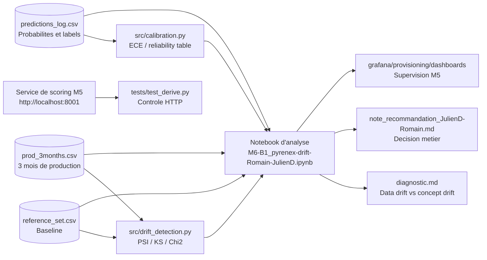

# M6-B1 — Analyse de dérive du modèle Pyrenex

Ce dépôt documente l'analyse des trois premiers mois de production du modèle
`pyrenex_risk_v2`, déployé au module M5. L'objectif est de distinguer un data
drift d'un concept drift et de proposer une remédiation proportionnée.

## Travail réalisé

L'analyse compare `reference_set.csv`, utilisé comme baseline, avec
`prod_3months.csv` et les probabilités de `predictions_log.csv`.

### Résultats principaux

- `int_rate` dérive fortement : PSI = **0,444**, p-value KS < 0,001.
- `revol_util` présente un signal à surveiller : PSI = **0,187**, p-value KS < 0,001.
- `grade` est redistribué : p-value du Chi² < 0,001.
- `annual_inc` évolue faiblement mais de façon détectable : PSI = **0,067**.
- L'AUC reste stable : **0,7419** sur les semaines 1-4 contre **0,7459** sur les semaines 9-12.
- Le F1 macro baisse de **0,6085** à **0,5506** et l'ECE augmente de **0,2403** à **0,3152**.

### Diagnostic et décision

Le diagnostic retenu est un **data drift plausible avec impact sur la calibration**.
L'AUC stable indique que le pouvoir de classement est conservé ; la baisse du F1
et la hausse de l'ECE montrent surtout que les probabilités et le seuil de
décision sont moins adaptés aux données récentes. Un concept drift massif n'est
pas démontré à ce stade.

La recommandation est de lancer un **réentraînement encadré sur données récentes**,
avec contrôle de la qualité des données, comparaison de l'AUC, du F1 macro et de
l'ECE, puis recalibration avant une éventuelle remise en production.

Les livrables de restitution sont [`diagnostic.md`](./diagnostic.md) et
[`note_recommandation_JulienD-Romain.md`](./note_recommandation_JulienD-Romain.md).

## Architecture



Les métriques PSI, KS, Chi², F1 et ECE sont calculées en batch dans le notebook
et ne sont pas des séries live Grafana. Le dossier Grafana contient les fichiers
de provisioning destinés à être intégrés à la stack M5 ; le contrôle du service
de scoring reste séparé dans `tests/test_derive.py`.

## Commandes utiles

### Installation

Depuis ce dossier :

```bash
python -m venv .venv
source .venv/bin/activate                 # Git Bash / Linux / macOS
pip install -r requirements.txt
```

Sous PowerShell Windows :

```powershell
python -m venv .venv
.\.venv\Scripts\Activate.ps1
pip install -r requirements.txt
```

### Analyse et tests

```bash
pytest -q tests
jupyter notebook notebooks/M6-B1_pyrenex-drift-Romain-JulienD.ipynb
```

Pour ouvrir le notebook modèle :

```bash
jupyter notebook notebooks/M6-B1_template.ipynb
```

### Vérification du backend M5

Le script suivant nécessite que la stack M5 soit démarrée et que le backend
réponde sur `http://localhost:8001` :

```bash
python tests/test_derive.py
```

Pour utiliser une autre adresse :

```bash
BACKEND_URL=http://localhost:8001 python tests/test_derive.py
```

## Arborescence des dossiers

```text
M6-B1-pyrenex-drift-Romain-JulienD/
├── data/
│   ├── reference_set.csv          # Jeu de référence / baseline
│   ├── prod_3months.csv           # Données des trois mois de production
│   └── predictions_log.csv        # Prédictions, probabilités et labels
├── notebooks/
│   ├── M6-B1_pyrenex-drift-Romain-JulienD.ipynb  # Analyse réalisée
│   └── M6-B1_template.ipynb                      # Support initial
├── src/
│   ├── drift_detection.py         # PSI, KS, Chi² et rapport de dérive
│   ├── calibration.py             # Table de fiabilité et ECE
│   └── recommendations.py         # Modèle de diagnostic et recommandations
├── tests/
│   ├── test_smoke.py               # Tests des données et fonctions clés
│   └── test_derive.py              # Contrôle manuel du service M5
├── grafana/
│   └── provisioning/dashboards/
│       ├── pyrenex_prod.json       # Dashboard de production
├── diagnostic.md                   # Diagnostic chiffré
├── note_recommandation_JulienD-Romain.md  # Note destinée au métier
├── requirements.txt                # Dépendances Python
└── ressources/                     # Mini-cours et liens de référence
```

## Ressources

Voir [`ressources/`](./ressources/) pour les mini-cours sur PSI/KS/Chi², le
data drift, la calibration, la note client et l'extension Grafana.
